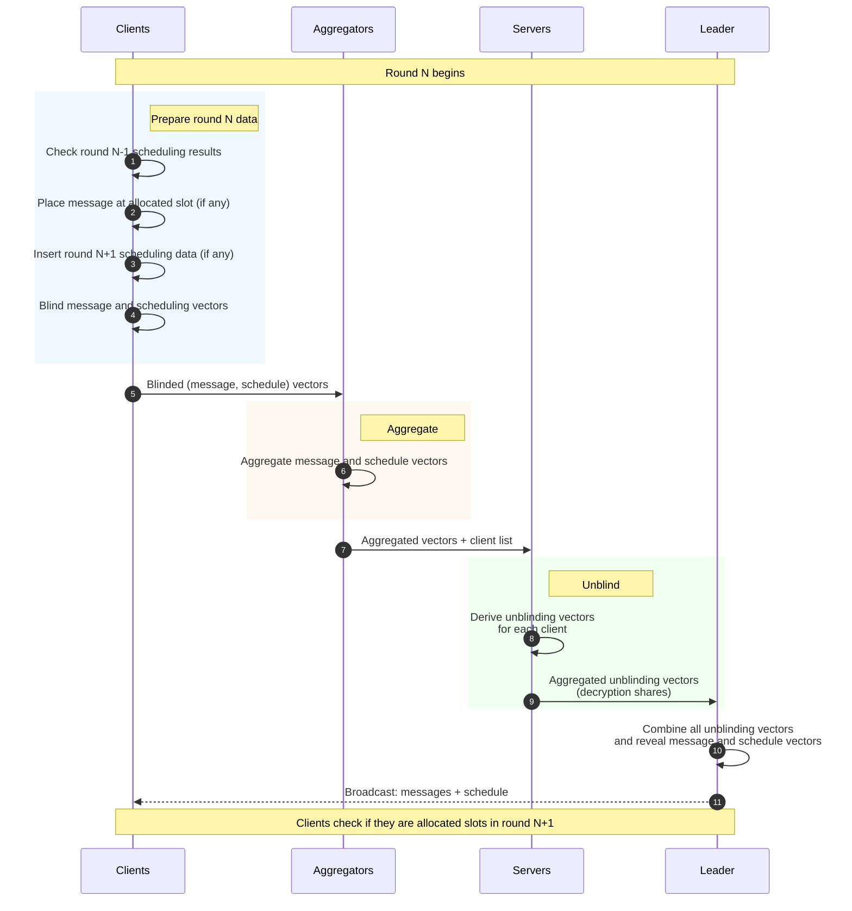
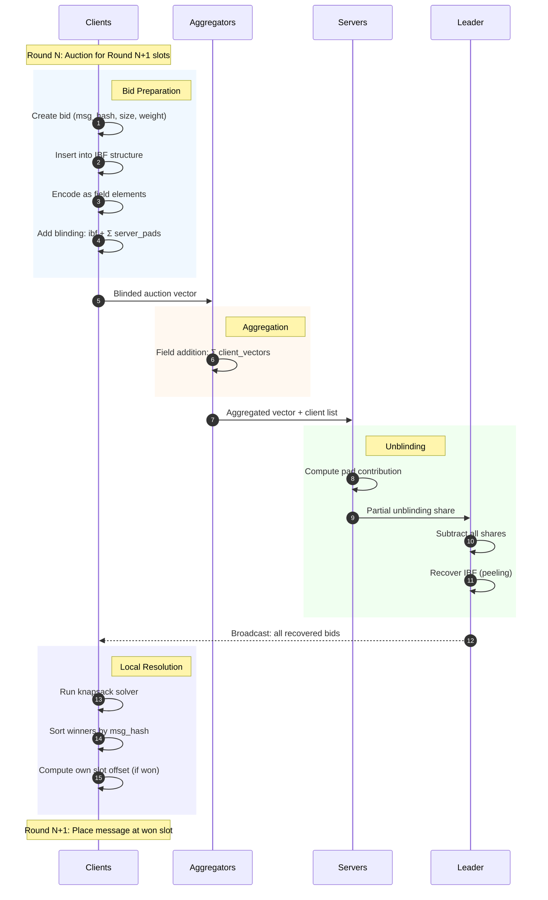

# Auction-based DCNet

## ZIPNet

[ZIPNet: Low-bandwidth anonymous broadcast from (dis)Trusted Execution Environments](https://eprint.iacr.org/2024/1227), as most DC nets, is run by a set of Clients and Servers. Clients attempt to send messages anonymously ("talking") and in addition provide "cover traffic", network traffic that hides where the actual messages originate. The set of "talking" Clients and Clients sending "cover traffic" makes up the anonymity set — the aim is for any realistic adversary to not be able to distinguish the actual origin of any message better than chance within the anonymity set. Clients encrypt ("blind") their messages to some set of Servers, which then collaboratively decrypt ("unblind") the messages, revealing the content. ZIPNet in addition introduces Aggregators, a middle layer that lessens network bandwidth requirements for Servers by aggregating large subsets of Client messages into a single message which is forwarded to the Servers.  

The protocol consists of two rounds: scheduling and messaging. For simplicity the scheduling is piggy-backing on messaging, which results in a single round consisting of a single message containing both the message for the current round, and the scheduling for the upcoming round.  

**Reference diagram**  

## ZIPNet protocol key details

**Scheduling in ZIPNet**  
As in other DCNet constructions, Clients can only send messages in preallocated slots. In ZIPNet, which this protocol is mostly based, scheduling is done by inserting a message fingerprints into a (large) scheduling bitvector. Each Client which wants to "talk" inserts their fingerprint at a pseudorandom location derived from their identity, blinds the scheduling vector with pairwise-shared secrets exchanged previously with Servers, and sends the resulting blinded vector to an Aggregator. Aggregators XOR all the scheduling vectors and forward the result to Servers for unblinding. When the scheduling vector is revealed, Clients check if their fingerprint appears unmodified in the revealed aggregate scheduling vector, if so they know they will not have conflicts with any other Clients and they map the position in the scheduling vector to a position in the message vector for the upcoming round.  

**Messaging in ZIPNet**  
Once the scheduling vector from the previous round is revealed, each Client knows whether it was allocated a message slot. If so, it simply inserts the message at the location dictated by a linear mapping of the scheduling vector to the message vector. The message vector is then blinded and sent to an Aggregator. Once an Aggregator has received enough of those messages for a big enough anonymity set, it XOR-s all of the messages together and forwards either to a hgher-level Aggregator or to Servers. Servers submit aggregated unblinding vectors to the round's leader which then reveals the message vector, which concludes the round.

**Blinding**  
Both the scheduling and the message vectors are encrypted in a simple n-of-n scheme. As a part of the setup of the protocol, each Client establishes a shared secret with each Server (pairwise).  

To blind a byte vector:
* each Client derives a vector of desired size from each of the shared secrets, and XOR-s all of those into one blinding vector
* the blinding vector is the XOR-ed with the plaintext vector, resulting in an encrypted ("blinded") vector  

Aggregators XOR all the blinded vectors they receive without the ability to unblind any of the data, which makes it impossible to subsequently unblind any specific user which is where the anonymity guarantee originates.  

To unblind a byte vector:
* each Server, upon receiving an aggregated message which contains information about which Clients have added their blinding vectors, derives an unblinding vector for each of the Client present in the aggregated message
* each server XOR-s all of the derived per-client unblinding vectors into one aggregate unblinding vector. Note that this is not enough to unblind the message, as Clients encrypt to all Servers, and one Server decrypts all Clients for that given Server
* each Server forwards their aggregated unblinding vector (decryption share) to the leader (one of the Servers)
* the leader then XOR-s all of the aggregated unblinding vectors into the final unblinding vector
* the combined unblinding vector is subsequently XOR-ed with the blinded ciphertext vector, revealing the aggregated plaintext content.  

Note that only the aggregate message is revealed, and it's not possible to unblind any message from a specific Client (deanonymizing them) without all Servers maliciously colluding.  

Because of the use of XOR, encryption is very fast, but has the major downside of requiring all Servers to be online. If any Server is offline or does not reveal their unblinding pad, the messages cannot be recovered.  

**Multi-layer aggregation**  
Aggregators solve a very concrete issue in DC nets: network bandwidth requirement for Servers. With just a thousand "talking" Clients and messages of 1MB, each Server would have to accept 1GB of network traffic each round, which while could be done is inadvisable. Instead, the Clients are split into smaller subsets, with each of the subset sending messages to an Aggregator. Each Aggregator accepts enough traffic to provide big enough anonymity set (say 1 hundred), and outputs a single aggregate message from all of the Client messages. The aggregate can be then subsequently sent to another Aggregator, further scaling the system.  

A single-layer network (30 Aggregators sending to 3 Servers) would handle up to 3'000 Clients with no single link receiving more than 100MB of data per round. A two-layer network (3 Servers, 30 top-level Aggregators, 3000 bottom-layer Aggregators) would handle up to 300'000 Clients with no single link receiving more than 100MB of data per round. Presence of Aggregators does not deter from the anonymity of the protocol, and the impact of malicious Aggregators is limited — at most only the downstream Clients are affected and they could simply chose to send to a different Aggregator.

**Weak Trusted Execution Environments (TEEs) in ZIPNet**  
Note that any Client, or Server misbehaving within the protocol will inattributably halt the protocol. Any malicious Client could malform their blinding pad or insert their data at the wrong position, overwriting any other Clients' data or making the message irrecoverable. The faults cannot be attributed. Any Server could malform their unblinding to the same effect. Aggregators are exempt from this, as ZIPNet uses falsification tags.  

To resolve those issues, ZIPNet relies on TEE computation integrity guarantees for all protocol participants (or, at least the Client and Server) — the fact that known code is running in the TEE guarantees honestly following the protocol rules. Anonymity property does not rely on TEEs, rather anonymity is achieved purely by cryptograpic means. Any TEE exploits can only impact the liveness of the protocol, rather than the anonymity of messages.  

TEEs and their integrity property is also used in ZIPNet for limiting the number of messages each Client can send in some window of rounds, limiting Client's ability to spam the protocol, which would make it harder to use for other Clients (scheduling conflicts).  

**Cover traffic**  
Non-talking Clients participate in the protocol by sending just their blinding vectors, which are simply encrypted zero-vectors. When the cover traffic is aggregated with actual data, they don't actually change any of the data — they simply XOR-in the blinding vectors, which are subsequently removed by Servers as part of unblinding. Cover traffic is crucial for anonymity, as it's what actually constructs the anonymity set.  

# Auction-based scheduling, variable-size messages

Notice that fingerprint-based scheduling proposed in ZIPNet effectively schedules Clients at random. While this does work for some use cases, it is far from optimal for others! What's more, Clients are limited to static, predefined size messages, which again works well in some cases and does not in other cases. One case in which random, static-size scheduling does not work well is sending blockchain transactions anonymously: they are neither created equal nor are they anywhere close to similar or static in size, and the transaction has to be transmitted atomically.  

What we propose instead is for the scheduling to be auction-based, with bids reflecting any utility a protocol might care about (protocol transaction fee, time since last message, maximum geographic diversity). The reasoning for it is that this scheme opens up the design space to basically any programmatic scheduling of messages, and specifically an auction maximizing some utility will by design allocate the (scarce and congested!) message vector slots. Whats more, since bids can contain metadata we can extend scheduling to also consider variable size messages, avoiding a whole number of issues that come with splitting large messages into chunks that make it through at random.  

We realize the auction-based scheduling through an **Invertible Bloom Filter (IBF)** which we encode as a vector of finite field elements, allowing us to blind and aggregate the structure for use in the protocol preserving anonymity properties. Other than using a different data structure and finite field cryptography over XOR the scheduling protocol looks almost the same as the fingerprint scheduling in ZIPNet.  

Clients put their bids (message hash, number of bytes, and utility) into the IBF, encode it as field elements vector, blind it using a pseudorandom vector of field elements derived from pairwise-shared secrets with all the Servers, and send the blinded vector to Aggregators. Each Aggregator adds all of the blinded scheduling vectors (addition in the field) and send the resulting vector to Servers for unblinding. Once the Servers collectively unblind the scheduling vector, each Client recovers the bids from the resulting unblinded IBF and runs a **knapsack solver** to determine winners of the auction ("talking clients"). Because the Clients are anyway running in TEEs we are not concerned with dishonest behavior, just like with fingerprint scheduling in ZIPNet. Since the result of the auction determines how many bytes should be allocated to the message vector, the message vector's size can by variable to save on unused message vector bandwidth, which is not possible with fingerprint scheduling.  

**Auction-based scheduling reference diagram**

The auction-based scheduling is less performant than the fingerprint-based scheduling because of the use of finite field addition over the much faster XOR. However, for some use cases the scheduling overhead is justified thanks to the optimal allocation of the much bigger message vector.  

**TEE Aggregators in ADCNet**  
Unline in ZIPNet, Aggregators in ADCNet also run in TEEs for now to preserve the integrity of aggregating auction scheduling vectors. This can be realized by cryptograpic schemes, but is more involved and the performance hit is likely to be unwarranted. Like in ZIPNet, TEEs are only relied upon for their integrity, not privacy.  
